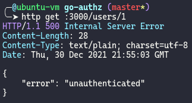
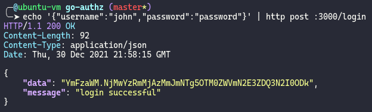
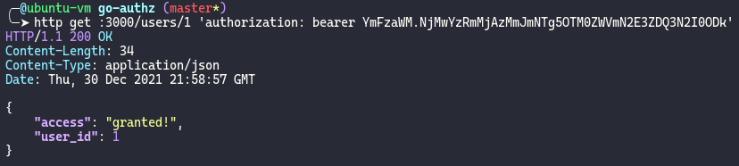

# Go authorization pattern

This repository demonstrates an authorization pattern that allows multiple schemes.

## Demo

To start the demo run the following command. The `--migrate` flag is only required the first time, this makes sure the
database is populated with some data. I use httpie to perform easy http requests.

```sh
go run main.go --migrate
```

**Can't access user information without being authenticated and authorized**


**Login will create a token**


**Use the token in the authorization header and access is granted**


Try accessing `/users/2`, what if you login as `bob`(`password`)?

## Using this pattern

Registering authenticators and authorizers

```go
type App struct {
    DB *sqlx.DB
    auth security.Authenticator
    authz security.Authorizer
}

func (app *App) registerSecurityMethods() {
	// Create the user session manager
	// We pass a principal-creator function that will create a principal from the session data
	app.sessions = usersession.New(app.DB, func(c context.Context, session *usersession.Session) (security.Principal, error) {
		return &User{
			UserID: int(session.Data.UserID),
			Rights: make([]string, 0),
		}, nil
	})

	// Register the session authenticator to the usersession credential type
	// Whenever a credential is provided with the type `usersession.Type`, this session authenticator will be used
	app.auth = security.NewAuthenticationRegistery().
		Add(usersession.Type, app.sessions)

	// Register the user principal authorizer to the user principal type
	// Notice in the usersession constructor we provide a principal-creator function that will create a principal from the session data
	// this will create the user principal which will be used by this authorizer
	app.authz = security.NewAuthorizerRegistry().
		Add(UserPrincipalType, NewUserAuthorizer())
}
```

Authenticating and authorizing a request

```go
type App struct {
    DB *sqlx.DB
    auth security.Authenticator
    authz security.Authorizer
}

func (app *App) getUserData(rw http.ResponseWriter, r *http.Request) {
    // Extract token from authorization header and authenticate the request
    // the principal will be available in the context
    // Note: this process is usually done in some middleware
    credential := "...."
    ctx, err := app.auth.Authenticate(r.Context(), credential)
    if err != nil {
        // Handle error
    }

    // The context is authenticated, the authorizer will use the context to
    // find the right authorizer and forward the right assertion
    var resourceURN = "project:user:1"
    if err := app.authz.MustHaveRights(ctx, resourceURN, "user.read"); err != nil {
        // Handle error
    }
    
    // request is authorized
}
```
## Installation

**Dont use this package!**
This repository is to show one how authorization for different schemes might be done.
You should use the code in this repository and modify it to your requirements and liking.
Like, you might not use URNs to identify resources.


## License

[MIT](https://choosealicense.com/licenses/mit/)

